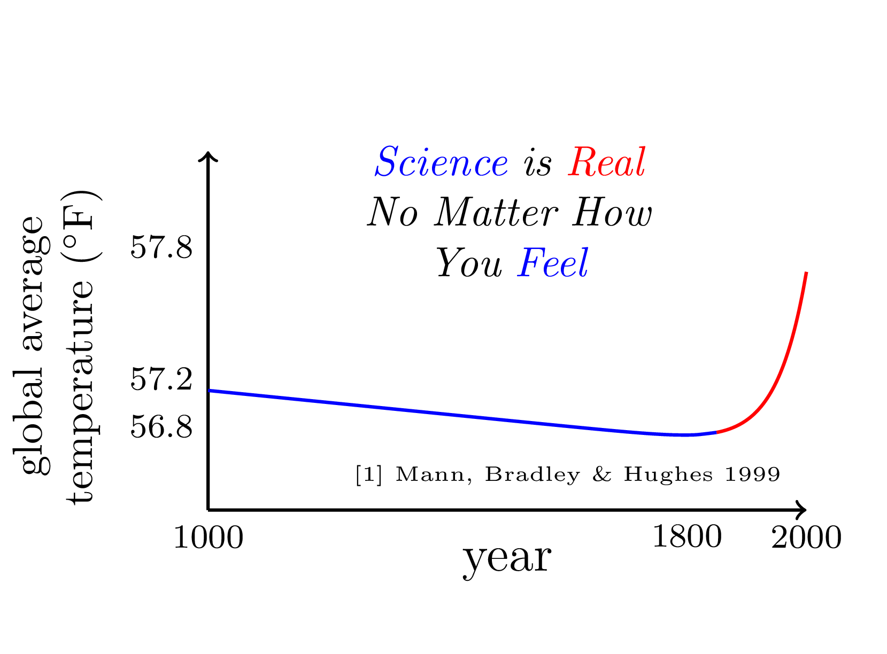

# march-for-science-sign

Author: Jonah Miller (jonah.maxwell.miller@gmail.com)

A design for a protest sign for the march for science. pdf and png
files available. There are two versions, one without labels:

and one with:

The plot is based on the famous
[Hockey-Stick graph](https://en.wikipedia.org/wiki/Hockey_stick_graph)
by [Mann, Bradley, and Hughes](https://dx.doi.org/10.1029%2F1999GL900070).
